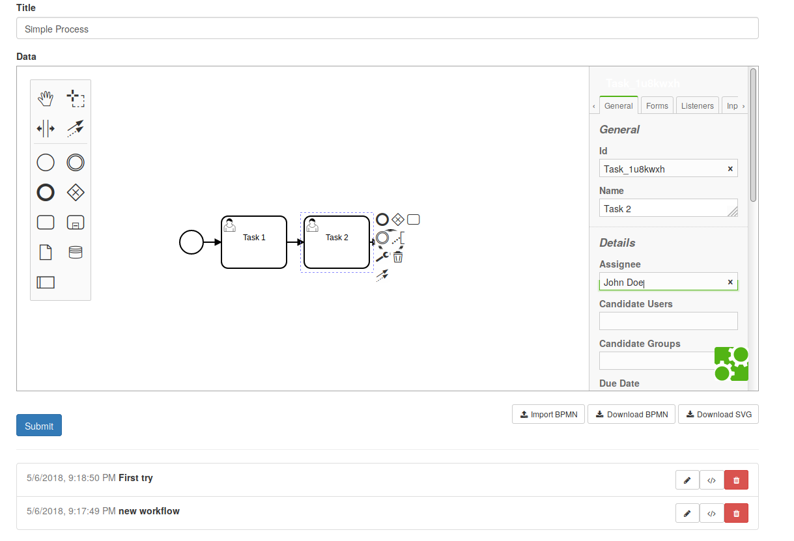

# meteor-autoform-bpmn-example
Demo for the AutoForm extension [jkuester:autoform-bpmn](https://github.com/jankapunkt/meteor-autoform-bpmn).

### Installation

On linux or OSX just run

```
$ ./run.sh
```

On windows you need to run

```
Set METEOR_PACKAGE_DIRS=%CD%\..
meteor --port=9999
```

### Screenshot



